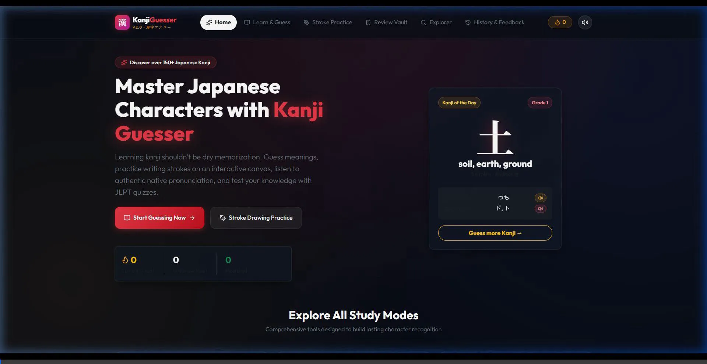
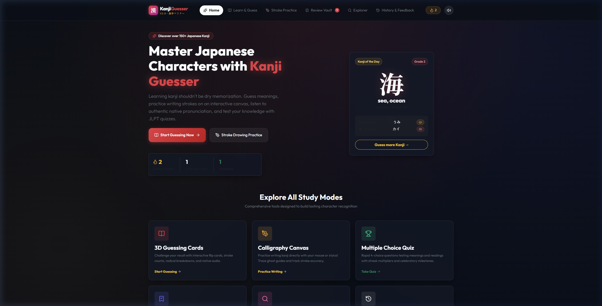
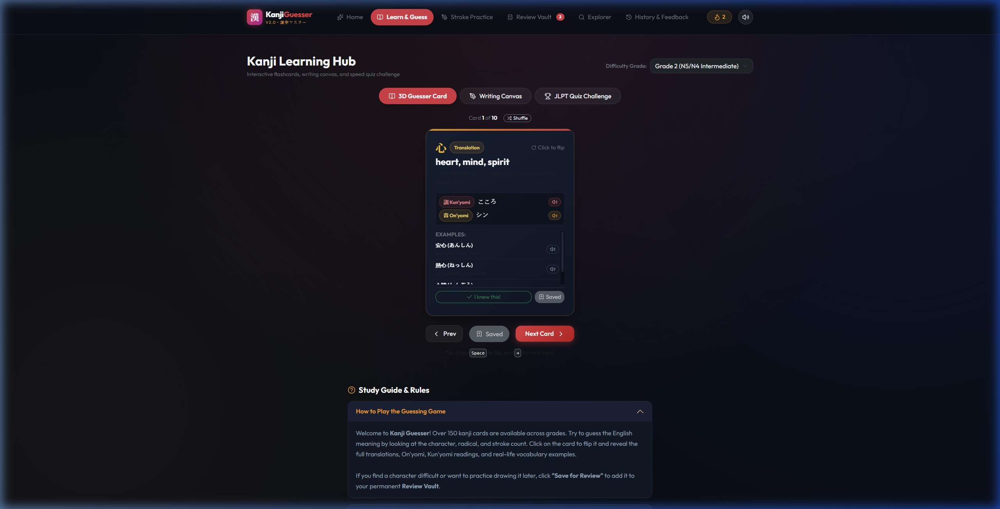
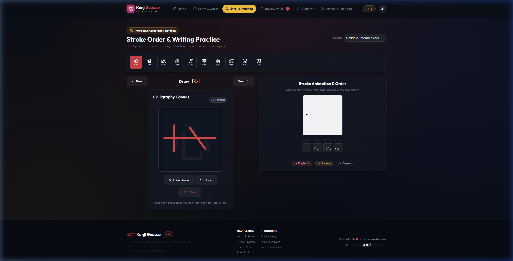
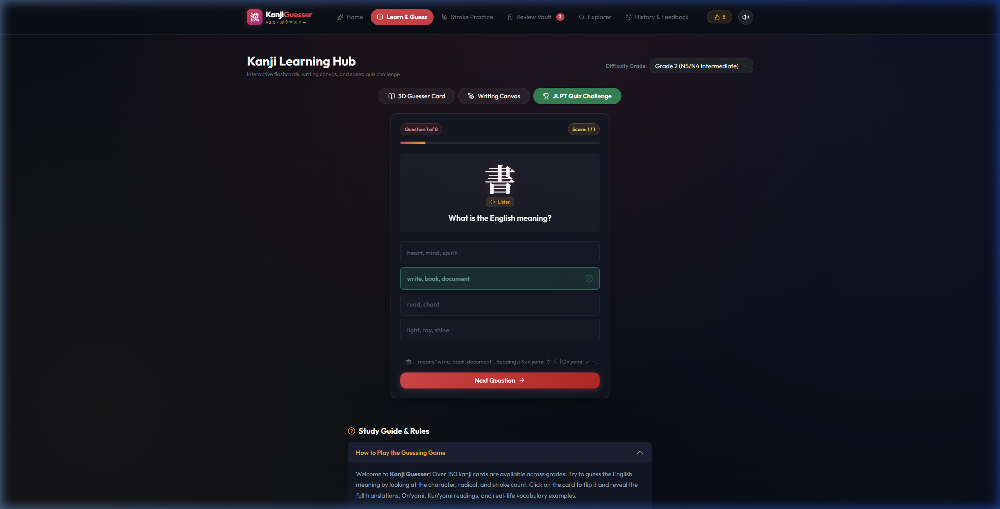
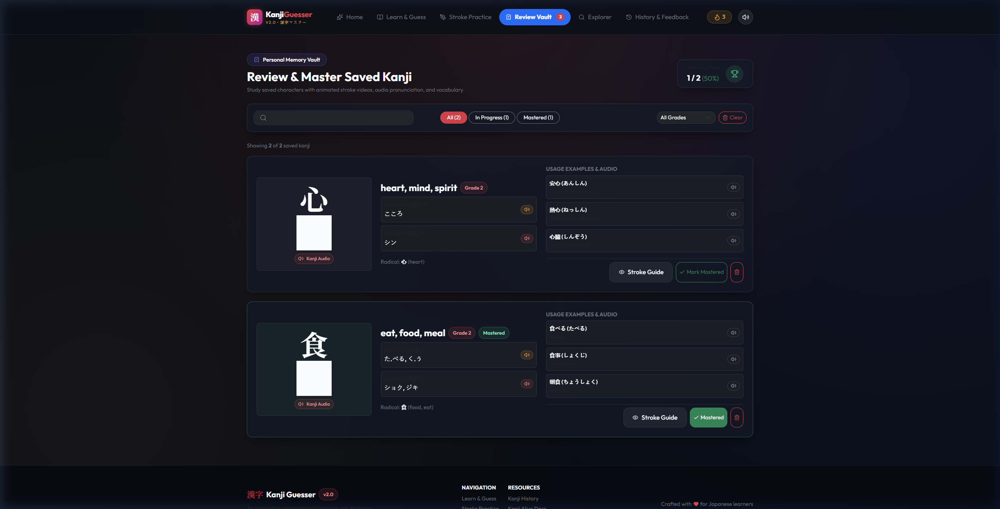
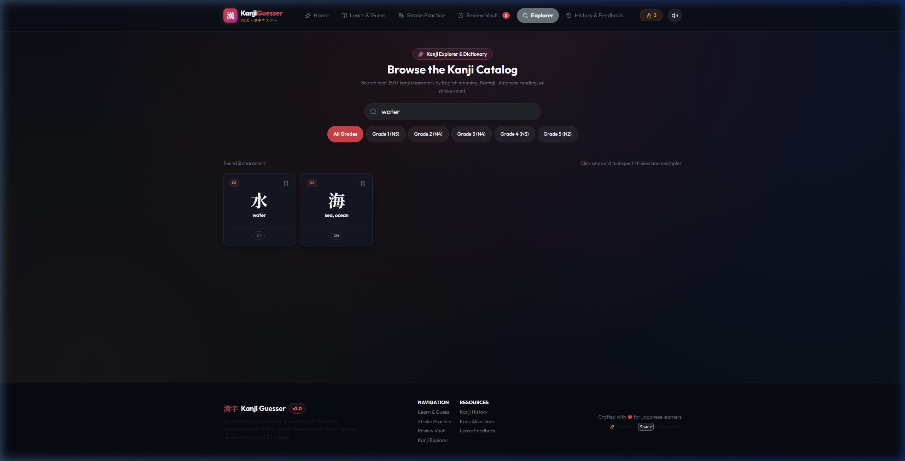
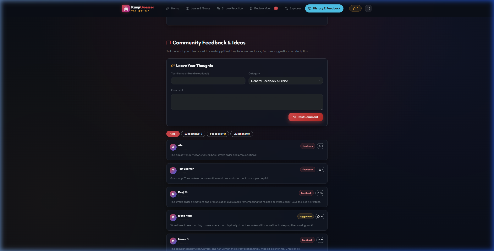

# Kanji Guesser v2.0 漢字マスター
### Modern Japanese Kanji Learning Platform
Built with **React 18, TypeScript, Vite, Web Audio API, Web Speech API, and Bootstrap 5**.



---

## 🌟 Key Features

- **3D Guessing Cards**: Interactive flip cards with stroke counts, radical badges, mnemonic aids, and instant answer reveals.
- **Native Japanese Speech & Audio**: Hear authentic pronunciation for kanji characters, Kun'yomi, On'yomi, and vocabulary sentences via native speech synthesis and CDN audio links.
- **Calligraphy & Stroke Drawing Canvas**: Practice writing kanji directly on an interactive HTML5 canvas with ghost guides, stroke counts, undo, and brush physics.
- **JLPT Quiz Challenge**: Test knowledge with 4-choice timed questions on character meanings and readings, featuring streak multipliers and celebratory confetti.
- **Review Vault**: Permanent `localStorage`-backed repository for difficult characters with animated stroke MP4 videos, search, and mastery tracking.
- **Kanji Explorer & Dictionary**: Search over 150+ kanji characters across grades by English keyword, Romaji, or Japanese readings.
- **Cultural Chronicles & History**: Preserves comprehensive educational guides on ancient Chinese hànzì origins, On'yomi vs Kun'yomi distinctions, and memory study science.
- **Community Feedback Board**: Persistent suggestions, bug reporting, and feedback board with upvotes and categories.
- **Neo-Tokyo Ink Design System**: Premium dark aesthetic with Torii vermilion (`#e63946`), sakura pink, imperial gold accents, and Japanese calligraphy typography.

---

## 📸 Screenshots and Videos

### Home Page
The flagship landing page with daily featured kanji, live progress stats (streak, vault count, mastered), and instant navigation into study modes.


### 3D Guessing Cards
Flip the card to reveal English translations, Kun'yomi (訓読み), On'yomi (音読み), and practical vocabulary examples with native audio pronunciation.


### Interactive Calligraphy & Stroke Practice Canvas
Draw and trace kanji characters directly using your mouse or touch screen. Features a ghost calligraphy guide, automatic stroke counting, undo, and clear actions.


### Multiple Choice JLPT Quiz Challenge
Fast-paced 4-choice quizzes testing character meanings and readings with instant visual feedback, explanations, and streak milestones.


### Review Vault & Mastery Tracker
Saved kanji are stored permanently in browser storage. Study characters with animated stroke order videos, filter by grade or mastery level, and track your learning progress.


### Kanji Explorer & Dictionary
Search and browse the full catalog of kanji characters across grades by English meaning, reading, or character. Inspect any card to view detailed stroke videos and examples.


### History Chronicles & Community Feedback
Deep dive into the origin of kanji from Chinese hànzì, On'yomi vs Kun'yomi rules, and leave comments, feature requests, or questions on the community board.


---

## 🚀 Quick Start

### 1. Clone & Install
```bash
git clone https://github.com/GiaxUp/kanji-guesser.git
cd kanji-guesser
npm install
```

### 2. Run the Development Server
```bash
npm run dev
```
The application will launch at `http://localhost:5173`. Zero configuration or external API keys are required to start studying immediately.

### 3. Build for Production
```bash
npm run build
```

---

## 📁 Project Architecture

```
src/
  ├── components/
  │   ├── common/         # Navbar, Footer, AudioButton, Badge
  │   ├── kanji/          # KanjiCard (3D flip), StrokeCanvas, StrokeOrderViewer, KanjiModal
  │   ├── quiz/           # QuizMode (4-choice challenge with streak scoring)
  │   ├── review/         # ReviewCardItem, ReviewFilterBar
  │   └── comments/       # FeedbackBoard (persistent community suggestions)
  ├── context/            # KanjiContext (study state, streaks, sound toggle, review vault)
  ├── data/               # kanjiDataset (grades 1-5), historyData, sampleComments
  ├── services/           # audioService (Web Audio + SpeechSynthesis), kanjiService
  ├── styles/             # index.css (Neo-Tokyo Ink design system tokens & glassmorphism)
  ├── types/              # kanji.ts (strict TypeScript definitions)
  └── pages/              # Home, Learn, Practice, Review, Dictionary, History
```

---

## 💡 Keyboard Shortcuts
- <kbd>Space</kbd>: Flip the active guessing card.
- <kbd>→</kbd> (Right Arrow): Move to next card.
- <kbd>←</kbd> (Left Arrow): Move to previous card.

---

## 📜 Public API & Acknowledgments
- Inspired by and compatible with the [Kanji Alive API](https://app.kanjialive.com/api/docs).
- Media, stroke order animations, and audio references provided by Kanji Alive open-source resources.
